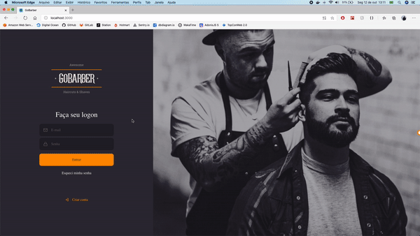

<h1 align="center">
    
</h1>

<h4 align="center">
	:heavy_check_mark: #GoBarber web :rocket: :heavy_check_mark:
</h4>

<p align="center">

  <a href="https://github.com/fnoquiq/gobarber-web/stargazers">
    
  </a>

  <a href="https://github.com/fnoquiq/gobarber-web/issues">
    
  </a>

  <a href="https://github.com/fnoquiq/gobarber-web/network/members">
    
  </a>

  <a href="https://github.com/fnoquiq/gobarber-web/blob/master/LICENSE">
    
  </a>

</p>

### Iniciar servidor

```bash
# Entre na pasta web
$ cd gobarber-web

# Instale as dependências
$ yarn install

# Inicie o servidor
$ yarn start

```

<h1 align="center">
    
</h1>
